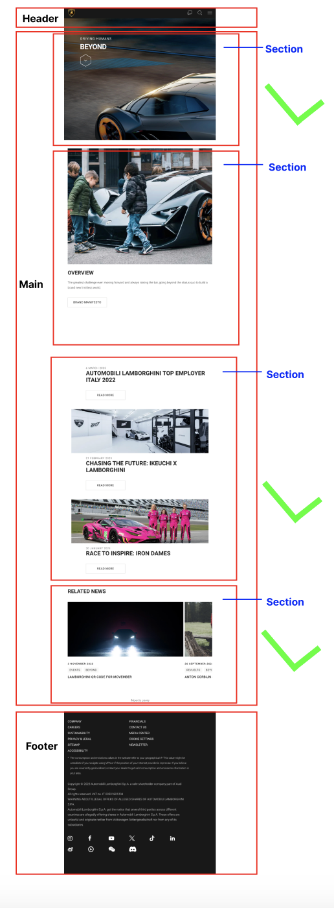

# Procesverslag
Markdown is een simpele manier om HTML te schrijven.  
Markdown cheat cheet: [Hulp bij het schrijven van Markdown](https://github.com/adam-p/markdown-here/wiki/Markdown-Cheatsheet).

Nb. De standaardstructuur en de spartaanse opmaak van de README.md zijn helemaal prima. Het gaat om de inhoud van je procesverslag. Besteedt de tijd voor pracht en praal aan je website.

Nb. Door *open* toe te voegen aan een *details* element kun je deze standaard open zetten. Fijn om dat steeds voor de relevante stuk(ken) te doen.

## Jij

  
uitwerken voor kick-off werkgroep

  ### Auteur:
  Ahmadriza Sewruttan

  #### Je startniveau:
  Rood

  #### Je focus:
Responsive 

## Je website

  
uitwerken voor kick-off werkgroep

  ### Je opdracht:
  link naar de website: https://www.lamborghini.com/en-en 
  
  Omschrijving: Lamborgini is een sportauto website waar je kunt kijken wat het is en welke auto's er allemaal zijn.

  #### Screenshot(s) van de eerste pagina (small screen): 
  Home pagina 
  
  

  

  #### Screenshot(s) van de tweede pagina (small screen):
 Beyond pagina 
 
  
 

## Toegankelijkheidstest 1/2 (week 1)

  
uitwerken na test in 2e werkgroep

  ### Bevindingen
  Lijst met je bevindingen die in de test naar voren kwamen:

## Breakdownschets (week 1)

  
uitwerken na afloop 3e werkgroep

 Home pagina 
  

 Beyond pagina 
  

## Voortgang 1 (week 2)

  
uitwerken voor 1e voortgang

  ### Stand van zaken
  hier dit ging goed & dit was lastig (neem ook screenshots op van delen van je website en code)

  ### Agenda voor meeting
  samen met je groepje opstellen

  Namen:
  
  Merle:

  Ahmadriza: - Ik wil weten hoe je een video/annimatie van de inspector kunt halen. Bij mijn site is dat nog ingewikkeld. 
             - Hoe de li in de nav zo tonen dat op mobiel formaat het verdwijnt in de dropdown menu en bij desktop wel zichrbaar is
              

  Quinten: student 2/Quinten Weimer: Moet een form om mee te zoeken in de header of er buiten?
          - Hoe maak ik dingen klikbaar zonder meer dan 1 html pagina?
          - Hoe spreek ik mijn gewenste images aan? Ze zitten allemaal boven een h3 dus mis kan ik daar wat mee.
          - Marquee, hoe werkt het met screenreader en hoe maak ik drie verschillende berichtjes?

  Niels:  - ik wil weten hoe ik de knoppen beter kan centreren en de specifieke vormgeving aan kan passen
          - weten hoe ik de verschillende afbeeldingen een eigen stijl kan geven op een makkelijke manier hoe kan ik de screenreader                goed maken.

  ### Verslag van meeting
  hier na afloop snel de uitkomsten van de meeting vastleggen

tijdens het 1e voortgangsgesprek kon  iedereen zijn/haar vragen stellen en die werd uiteraard behandeld met uitleg. Bij dit gesprek heb ik niet alleen antwoord gekregen van mijn vragen maar ook weer bijgeleerd van de vragen van mijn clubje. 

- Doordat ik het video source niet kon vinden of eigenlijk wel kon vinden maar niet kon gebruiken omdat het beveiligd was mocht ik een alternatief opzoeken en die gebruiken met de <video> tag.
- Als 2e wat ook intressant was, was het gedeelte hoe je in de header (nav) responsive maakt dat naarmate het scherm groter wordt je meer te zien krijgt. Hiervoor kon je 2 functies voor gebruiken: flex en grid. Ook kon je d.m.v. de @media (min/max/ hight) tag erovor zorgen dat het responsive wordt.

## Voortgang 2 (week 3)

  
uitwerken voor 2e voortgang

  ### Stand van zaken
  hier dit ging goed & dit was lastig (neem ook screenshots op van delen van je website en code)

  ### Agenda voor meeting
  samen met je groepje opstellen

  | student 1      | student 2          | student 3    | student 4        |
  | ---            | ---                | ---          | ---              |
  | dit bespreken  | en dit             | en ik dit    | en dan ik dat    |
  | en dat ook nog | dit als er tijd is | nog een punt | dit wil ik zeker |
  | ...            | ...                | ...          | ...              |

  ### Verslag van meeting
  hier na afloop snel de uitkomsten van de meeting vastleggen

  - punt 1
  - punt 2
  - nog een punt
- ...

## Toegankelijkheidstest 2/2 (week 4)

  
uitwerken na test in 9e werkgroep

  ### Bevindingen
  Lijst met je bevindingen die in de test naar voren kwamen (geef ook aan wat er verbeterd is):

## Voortgang 3 (week 4)

  
uitwerken voor 3e voortgang

  ### Stand van zaken
  hier dit ging goed & dit was lastig (neem ook screenshots op van delen van je website en code)

  ### Agenda voor meeting
  samen met je groepje opstellen

  | student 1      | student 2          | student 3    | student 4        |
  | ---            | ---                | ---          | ---              |
  | dit bespreken  | en dit             | en ik dit    | en dan ik dat    |
  | en dat ook nog | dit als er tijd is | nog een punt | dit wil ik zeker |
  | ...            | ...                | ...          | ...              |

  ### Verslag van meeting
  hier na afloop snel de uitkomsten van de meeting vastleggen

  - punt 1
  - punt 2
  - nog een punt
  - ...

## Eindgesprek (week 5)

  
uitwerken voor eindgesprek

  ### Je uitkomst - karakteristiek screenshots:
  

  ### Dit ging goed/Heb ik geleerd: 
  Korte omschrijving met plaatjes

  

  ### Dit was lastig/Is niet gelukt:
  Korte omschrijving met plaatjes

  

## Bronnenlijst

  
continu bijhouden terwijl je werkt

  Nb. Wees specifiek ('css-tricks' als bron is bijv. niet specifiek genoeg). 
  Nb. ChatGpT en andere AI horen er ook bij.
  Nb. Vermeld de bronnen ook in je code.

  1. bron 1
  2. bron 2
  3. ...

